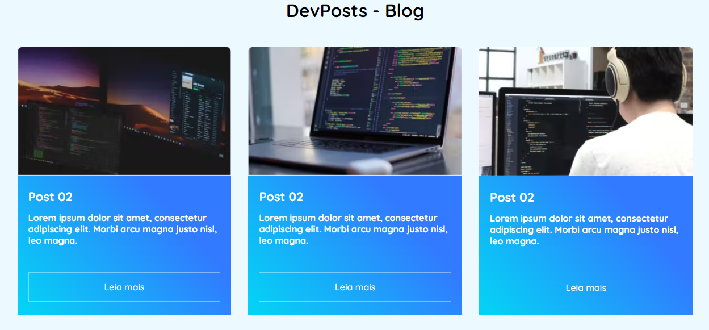

<h1 align="center"> DevPosts - Blog </h1>

  <a href="#-tecnologias">Tecnologias</a>&nbsp;&nbsp;&nbsp;|&nbsp;&nbsp;&nbsp;
  <a href="#-projeto">Projeto</a>&nbsp;&nbsp;&nbsp;|&nbsp;&nbsp;&nbsp;
  <a href="#-layout">Layout</a>&nbsp;&nbsp;&nbsp;|&nbsp;&nbsp;&nbsp;
  <a href="#memo-licença">Licença</a>

  

 

  

## 🚀 Tecnologias

Esse projeto foi desenvolvido com as seguintes tecnologias:

- HTML
- Styled-Components
- ReactJS
- Typescript
- [Prismic CMS](https://prismic.io)
- [Vite](https://vitejs.dev/)

## 💻 Projeto

Um Blog de noticias devs, com as noticias vindo de um CMS, totaltamente responsivo

## 🔖 Layout

Você pode visualizar o layout do projeto através [DESSE LINK](https://www.figma.com/file/4H065NRvuZuN5x8Rs3807Q/DevPosts---Desafio). É necessário ter conta no [Figma](https://figma.com) para acessá-lo.

## :memo: Licença

Esse projeto está sob a licença MIT.

---
